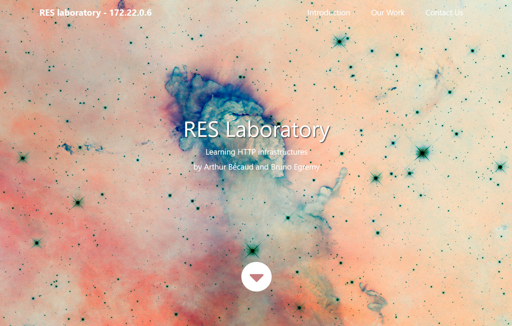

# RES Lab - HTTP Infrastructure
Arthur Bécaud, Bruno Egremy

## About the repository
[Here](https://github.com/egremyb/Teaching-HEIGVD-RES-2020-Labo-HTTPInfra) is the github repository containing our lab solution.  

The file tree is the following.
```
/
├── LICENSE
├── README.md
├── build_all_images.sh
├── docker-images
│   ├── apache-php-image
│   │   ├── Dockerfile
│   │   └── src
│   │       ├── css
│   │       ├── fontawesome-5.5
│   │       ├── img
│   │       ├── index.php
│   │       ├── js
│   │       │   ├── animals.js
│   │       │   ├── bootstrap.min.js
│   │       │   ├── jquery-1.9.1.min.js
│   │       │   └── jquery.singlePageNav.min.js
│   │       ├── magnific-popup
│   │       └── slick
│   ├── apache-reverse-proxy-image
│   │   ├── Dockerfile
│   │   └── conf
│   │       └── sites-available
│   │           ├── 000-default.conf
│   │           └── 001-reverse.proxy.conf
│   ├── express-image
│   │   ├── Dockerfile
│   │   └── src
│   │       ├── index.js
│   │       ├── node_modules
│   │       ├── package-lock.json
│   │       └── package.json
│   └── traefik-image
│       ├── conf
│       │   └── traefik.toml
│       ├── docker-compose.yml
│       └── traefik_run.sh
└─── report.md
```
**--- TODO: explain the file tree ---**

## Apache-PHP server
### Docker image creation
The docker file is the following :
```
FROM php:7.2-apache

RUN apt-get update && \
    apt-get install -y vim

COPY src/ /var/www/html/
```
The base image is the official PHP with Apache 7.2 image which is translated into this line : `FROM php:7.2-apache`.  
The `RUN` statement let us run commands like the 2 above :
- `apt-get update`
- `apt-get install -y vim`

The package list is updated with the first one and then the _vim_ application is installed.

The last line let us copy our website template from the _src_ directory into the "futur" container's _/var/www/html/_ directory which is website content location from the official php image documentation.

The template used here is [The Town](https://templatemo.com/tm-525-the-town) from [templatemo](https://templatemo.com).

### Customizing the template
The template we used look like the following picture.


We customized it by changing the background image with a few titles through the _index.html_ file.



_This capture was taken at the very end of the project._

## Express.js application
### Docker image creation
The docker file is the following :
```
FROM node:12.16.3

COPY src /opt/app

CMD ["node", "/opt/app/index.js"]
```

The first line `FROM node:12.16.3` shows which base image is used, the official node 12.16.3 image in this case.

The next line will copy our express application from the _src_ directory into the futur container's _opt/app_ directory **--- TODO: explain why copying it in /opt/app ---**.

Then the last line let us prepare the command `node /opt/app/index.js` to execute on the container when it will run.

### Our express animals service
The file _index.js_ we copy and execute is used to run the express service. The file content is the following.

 ```js

 // Required libraries
var Chance = require('chance');
var chance = new Chance();

const express = require('express');
const app = express();

// When service is accessed, return an array of animals
app.get('/', function (req, res) {
    res.send(generateAnimals());
});

// Write a log with a random animal name when the port 80 is accessed
app.listen(80, function () {
    console.log("Dang an HTTP request ! You're such a " + chance.animal());
});

// Generate an Array of animals with their specie, weight and battle cry
function generateAnimals() {
	// Randomize the number of animals to generate
    var numberOfAnimals = chance.integer({
        min: 1,
        max: 10
    });

    console.log(numberOfAnimals);

	// Generate the animals
    var animals = [];
    for (var i = 0; i < numberOfAnimals; i++) {
		// Random animal
        var animal = chance.animal();
		// Random weight
        var weight = chance.floating({
            min: 0.01,
            max: 1000
        });

		// Random battle cry
        var syllables = chance.integer({
            min: 1,
            max: 3
        });

        var battleCry = "";

		for (var j = 0; j < syllables; j++) {
            battleCry += chance.syllable();
        }

		battleCry += battleCry;

		// Push the new animal to the array
        animals.push({
            specie: animal,
            weight: weight,
            battleCry: battleCry
        })
    }

    console.log(animals);

    return animals;
}
```

This file let us generate return an array of animals with their specie, weight and battle cry when the express service is requested.


## Apache reverse proxy
**--- TODO: explain this chapter [lol x)]---**
### Docker image creation
```
FROM php:7.2-apache

RUN apt-get update && \
    apt-get install -y vim

COPY conf/ /etc/apache2

RUN a2enmod proxy proxy_http
RUN a2ensite 000-* 001-*
```
### _Reverse configuration ?_
_/conf/sites_available/000-default.conf_
```
<VirtualHost *:80>
</VirtualHost>
```
_/conf/sites_available/001-reverse.proxy.conf_
```
<VirtualHost *:80>
    ServerName labo.res.ch

    ProxyPass "/api/animals/" "http://172.17.0.3:3000"
    ProxyPassReverse "/api/animals/" "http://172.17.0.3:3000"

    ProxyPass "/" "http://172.17.0.2:80/"
    ProxyPassReverse "/" "http://172.17.0.2:80/"
</VirtualHost>
```

## JQuery requests
### _Our JQuerry service ?_

For our _JQuerry_ service, we used the following _animals.js_ file to handle the requests of the express service.

**--- TODO: replace "/api/animals/" with the proper ip at the time ---**

```js
$(function () {
    console.log("Loading animals...");

    function loadAnimals() {
		// Make a request forward the express animals service
        $.getJSON("/api/animals/", function (animals) {

			console.log(res);

			// Default content message
            let title    = "Nobody is here";
            let subtitle = "Ain't nobody got time for that"

			// Check if the values from res object are defined to enter the if statement
            if (animals != 'undefined') {
				// Set title and subtitle messages
                title = "- " + animals[0].battleCry;
                subtitle = "Said the " + animals[0].weight + " kg " + animals[0].specie;
            }

			// Replace text content from element with classes tm-hero-title or tm-hero-subtitle
            $(".tm-hero-title").text(title);
            $(".tm-hero-subtitle").text(subtitle);
    };

	// Call once the loadAnimals function
    loadAnimals();

	// Set an interval to call the loadAnimals function
    setInterval(loadAnimals, 4000);
});
```

It work by calling the `loadAnimals` function every 4000 ms. This function make a request to the express service which is supposed to return an array of animals with the attributes `specie`, `weight` and `battleCry`.

**--- TODO: explain the remaining of JQuerry service ---**

### Implementation within the html page
To implement the JQuerry in the _index.html_ file, we need to add the following script element for _animals.js_ file to be executed.
```js
<script src="js/animals.js"></script>
```
Then we must add the specific class attribute where we want the _JQuerry_ to change the text content. In will look like the next lines for us.
```html
<h2 class="tm-hero-title">RES Laboratory</h2>
<p class="tm-hero-subtitle">
    Learning HTTP infrastructures
    <br/>by Arthur Bécaud and Bruno Egremy
</p>
```

## Dynamic reverse proxy
To realize the dynamic reverse proxy, we choose to use `traefik`. This service provide a lot of functionalities including the load balancing, sticky sessions and a dynamic cluster management.
### Traefik configuration

**--- TODO: need explanation ---**

_/conf/traefik.toml_
```
defaultEntryPoints = ["http"]

[entryPoints]
  [entryPoints.traefik]
    address = ":8080"
  [entryPoints.http]
    address = ":80"

[api]
    insecure = true
    dashboard = true

[providers.docker]
endpoint = "unix:///var/run/docker.sock"
watch = true
exposedbydefault = false
```

### Docker-compose

_docker-compose.yml_
```
version: '3'

networks:
  res_http_lab_network:
    external: true
  internal:
    external: false

services:
  reverse-proxy:
    image: traefik:v2.2
    restart: unless-stopped
    ports:
      - 80:80
      - 8080:8080
    volumes:
      - /var/run/docker.sock:/var/run/docker.sock:ro
      - ./conf/traefik.toml:/traefik.toml:ro
    networks:
      - internal
      - res_http_lab_network

  express_animals:
    image: res/express_animals
    expose:
      - "80"
    labels:
      - "traefik.enable=true"
      - "traefik.port=80"
      - "traefik.http.routers.router-express_animals.rule=Path(`/api/animals/`)"
      - "traefik.http.routers.router-express_animals.service=express-animals-traefik-image"
      - "traefik.http.routers.router-express_animals.middlewares=strip_prefix"
      - "traefik.http.middlewares.strip_prefix.stripprefix.prefixes=/api/animals/"

    networks:
      - internal
      - res_http_lab_network

  apache_php:
    image: res/apache_php
    labels:
      - "traefik.enable=true"
      - "traefik.port=80"
      - "traefik.http.routers.router-apache_php.rule=PathPrefix(`/`)"
      - "traefik.http.routers.router-apache_php.service=apache-php-traefik-image"
    networks:
      - internal
      - res_http_lab_network
    depends_on:
      - express_animals
```

## Load balancing: multiple server nodes

## Load balancing: round-robin vs sticky sessions

## Dynamic cluster management

## Management UI
