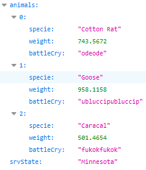

# RES Lab - HTTP Infrastructure
Arthur Bécaud, Bruno Egremy

## About the repository
[Here](https://github.com/egremyb/Teaching-HEIGVD-RES-2020-Labo-HTTPInfra) is the github repository containing our lab solution.  

The file tree is the following.
```
/
├── LICENSE
├── README.md
├── build_all_images.sh
├── docker-images
│   ├── apache-php-image
│   │   ├── Dockerfile
│   │   └── src
│   │       ├── css
│   │       ├── fontawesome-5.5
│   │       ├── img
│   │       ├── index.php
│   │       ├── js
│   │       │   ├── animals.js
│   │       │   ├── bootstrap.min.js
│   │       │   ├── jquery-1.9.1.min.js
│   │       │   └── jquery.singlePageNav.min.js
│   │       ├── magnific-popup
│   │       └── slick
│   ├── apache-reverse-proxy-image
│   │   ├── Dockerfile
│   │   └── conf
│   │       └── sites-available
│   │           ├── 000-default.conf
│   │           └── 001-reverse.proxy.conf
│   ├── express-image
│   │   ├── Dockerfile
│   │   └── src
│   │       ├── index.js
│   │       ├── node_modules
│   │       ├── package-lock.json
│   │       └── package.json
│   └── traefik-image
│       ├── conf
│       │   └── traefik.toml
│       ├── docker-compose.yml
│       └── traefik_run.sh
└─── report.md
```
**--- TODO: explain the file tree ---**

## Apache-PHP server
### Docker image creation
The docker file is the following :
```
FROM php:7.2-apache

RUN apt-get update && \
    apt-get install -y vim

COPY src/ /var/www/html/
```
The base image is the official PHP with Apache 7.2 image which is translated into this line : `FROM php:7.2-apache`.  
The `RUN` statement let us run commands like the 2 above :
- `apt-get update`
- `apt-get install -y vim`

The package list is updated with the first one and then the _vim_ application is installed.

The last line let us copy our website template from the _src_ directory into the "futur" container's _/var/www/html/_ directory which is website content location from the official php image documentation.

The template used here is [The Town](https://templatemo.com/tm-525-the-town) from [templatemo](https://templatemo.com).

### Customizing the template
The template we used look like the following picture.


We customized it by changing the background image, a few titles and the _index_ file extension from _html_ to _php_ to add the server ip at the top left element with the next lines.

```html
<a href="#hero" class="navbar-brand">RES laboratory -
<?php echo $_SERVER['SERVER_ADDR']; ?>
</a>
```


### Apache config files location

Apache configuration file is located in one of these locations :

- _/etc/apache2/httpd.conf_
- _/etc/apache2/apache2.conf_
- _/etc/httpd/httpd.conf_
- _/etc/httpd/conf/httpd.conf_

_([reference](https://www.phusionpassenger.com/library/install/apache/working_with_the_apache_config_file.html))_

## Express.js application
### Docker image creation
The docker file is the following :
```
FROM node:12.16.3

COPY src /opt/app

CMD ["node", "/opt/app/index.js"]
```

The first line `FROM node:12.16.3` shows which base image is used, the official node 12.16.3 image in this case.

The next line will copy our express application from the _src_ directory into the futur container's _opt/app_ directory.

Then the last line let us prepare the command `node /opt/app/index.js` to execute on the container when it will run.

### Our express animals service
The file _index.js_ we copy and execute is used to run the express service. The file content is the following.

 ```js
// Required libraries
var Chance = require('chance');
var chance = new Chance();

const express = require('express');
const app = express();

// Set a random state name for the express service.
// Used to identify which express application is responding to the request.
// This name is like a static constant variable and will never differ unless
// the application is rebooted.
const srvState = chance.state({ full: true });

// When service is accessed, return an object containing :
// - animals: an array of animals
// - srvState: a random state location of the service
app.get('/', function (req, res) {
    res.send({
        animals: generateAnimals(),
        srvState: srvState
    });
});

// Write a log with a random animal name when the port 80 is accessed
app.listen(80, function () {
    console.log("Dang an HTTP request ! You're such a " + chance.animal());
});

// Generate an Array of animals with their specie, weight and battle cry
function generateAnimals() {
	// Randomize the number of animals to generate
    var numberOfAnimals = chance.integer({
        min: 1,
        max: 10
    });

    console.log(numberOfAnimals);

	// Generate the animals
    var animals = [];
    for (var i = 0; i < numberOfAnimals; i++) {
		// Random animal
        var animal = chance.animal();
		// Random weight
        var weight = chance.floating({
            min: 0.01,
            max: 1000
        });

		// Random battle cry
        var syllables = chance.integer({
            min: 1,
            max: 3
        });

        var battleCry = "";

		for (var j = 0; j < syllables; j++) {
            battleCry += chance.syllable();
        }

		battleCry += battleCry;

		// Push the new animal to the array
        animals.push({
            specie: animal,
            weight: weight,
            battleCry: battleCry
        })
    }

    console.log(animals);

    return animals;
}

```

This file let us generate an array of animals in a object with a state when the express service is requested. Each animal possesses the attributes specie, weight and battle cry. And the state name is set at the start of the service and will not change unless the service is started again. It will be used to identify the service amongst the others.


## Apache reverse proxy
### Docker image creation
```
FROM php:7.2-apache

RUN apt-get update && \
    apt-get install -y vim

COPY conf/ /etc/apache2

RUN a2enmod proxy proxy_http
RUN a2ensite 000-* 001-*
```

`a2enmod proxy proxy_http` will install the corresponding apache modules. While `a2ensite 000-* 001-*` will activate the two configurations file below.
### Reverse configuration
The _/conf/sites_available/000-default.conf_ file
```
<VirtualHost *:80>
</VirtualHost>
```
_/conf/sites_available/001-reverse-proxy.conf_
```
<VirtualHost *:80>
    ServerName labo.res.ch

    ProxyPass "/api/animals/" "http://172.17.0.3"
    ProxyPassReverse "/api/animals/" "http://172.17.0.3"

    ProxyPass "/" "http://172.17.0.2:80/"
    ProxyPassReverse "/" "http://172.17.0.2:80/"
</VirtualHost>
```
The ServerName acts like the host name for the http requests. It will be the prerequired prefix to the below URL. If the URL doesn't start with this prefix, the request won't be treated.

Those rules will forward any request to a matching URL to the corresponding ip. As the first matching URL is used, we need to order the rules from the st specific to the least specific one.

### Why static and dynamic servers cannot be reached directly
The static and dynamic servers are not exposed outside of the codcker network. Due to this we cannot access the servers directly without going through the apache reverse proxy exposed outisde the docker network.


The container _apache_php_ and _express_animals_ are unreachable directly because there is not ports open in docker environnement to expose them.

The only way to access them is to use the _apache_reverse_proxy_ container exposed to the port 80 with the url _lab.res.ch_ and _lab.res.ch/api/animals_.


## JQuery requests
### Our JQuerry service

For our _JQuerry_ service, we used the following _animals.js_ file to respond to the requests.

```js
$(function () {
    console.log("Loading animals...");

    function loadAnimals() {
        // Make a request forward the express animals service
        $.getJSON("/api/animals/", function (res) {

            console.log(res);

            // Default content message
            let title    = "Nobody is here";
            let subtitle = "Ain't nobody got time for that"

            // Get res object values from their key
            let animals = res["animals"];
            let srvState = res["srvState"];

            // Check if the values from res object are defined to enter the if statement
            if (animals != 'undefined' && srvState != 'undefined') {
                // Set title and subtitle messages
                title = "- " + animals[0].battleCry;
                subtitle = "Said the " + animals[0].weight + " kg " + animals[0].specie +
                           "<br/>Straight Outta " + srvState;
            }

            // Replace text content from with classes tm-hero-title or tm-hero-subtitle
            $(".tm-hero-title").text(title);
            $(".tm-hero-subtitle").text(subtitle);

            // Replace char from '<br/>' to make the line return work
            $(".tm-hero-subtitle").each(function () {
                var $this = $(this);
                var t = $this.text();
                $this.html(t.replace('&lt', '<').replace('&gt', '>'));
            });
        });
    };

    // Call once the loadAnimals function
    loadAnimals();

    // Set an interval to call the loadAnimals function
    setInterval(loadAnimals, 4000);
});

```

It work by calling the `loadAnimals` function every 4000 ms. This function make a request to the express service which is supposed to return an array of animals with a state name in an object.

After receiving the object the service first check if the two fields (_animals_ and _srvState_) are defined. If they are, we set two customize messages with the object's content. If they are not, we display two default messages.

Then we use the two messages to change the elements content with the class attribute set to `tm-hero-title` and `tm-hero-subtitle`.

### Implementation within the index page
To implement the JQuerry in the _index.html_ file, we need to add the following script element for the _animals.js_ file to be executed during the page loading.
```js
<script src="js/animals.js"></script>
```
Then we must add the specific class attribute where we want the _JQuerry_ to change the text content.
```html
<h2 class="tm-hero-title">RES Laboratory</h2>
<p class="tm-hero-subtitle">
    Learning HTTP infrastructures
    <br/>by Arthur Bécaud and Bruno Egremy
</p>
```


## Dynamic reverse proxy
To implement the dynamic reverse proxy, we choose to use `traefik`. This service provide a lot of functionalities including the load balancing, sticky sessions and a dynamic cluster management.
### Traefik configuration

Traefik need a configuration file, which you can see below.

_/conf/traefik.toml_
```
defaultEntryPoints = ["http"]

[entryPoints]
  [entryPoints.traefik]
    address = ":8080"
  [entryPoints.http]
    address = ":80"

[api]
    insecure = true
    dashboard = true

[providers.docker]
endpoint = "unix:///var/run/docker.sock"
watch = true
exposedbydefault = false
```
We set the entrypoint to a custom name "http". Then, we specify which entrypoint correspond to which port. Here, the _traefik_ entrypoint is the port 8080 and the default _http_ entrypoint is the port 80.

We enable the debug mode and the dashboard.

We allow Traefik to see our docker containers by giving him the docker socket.

### Docker-compose
This docker-compose.yml will launch our services.

_docker-compose.yml_
```
version: '3'

networks:
  res_http_lab_network:
    external: true
  internal:
    external: false

services:
  reverse-proxy:
    image: traefik:v2.2
    restart: unless-stopped
    ports:
      - 80:80
      - 8080:8080
    volumes:
      - /var/run/docker.sock:/var/run/docker.sock:ro
      - ./conf/traefik.toml:/traefik.toml:ro
    networks:
      - internal
      - res_http_lab_network

  express_animals:
    image: res/express_animals
    expose:
      - "80"
    labels:
      - "traefik.enable=true"
      - "traefik.port=80"
      - "traefik.http.routers.router-express_animals.rule=Path(`/api/animals/`)"
      - "traefik.http.routers.router-express_animals.service=express-animals-traefik-image"
      - "traefik.http.routers.router-express_animals.middlewares=strip_prefix"
      - "traefik.http.middlewares.strip_prefix.stripprefix.prefixes=/api/animals/"
      - "traefik.http.services.express-animals-traefik-image.loadbalancer.sticky=true"
      - "traefik.http.services.express-animals-traefik-image.loadbalancer.sticky.cookie.name=StickyCookie"
      - "traefik.http.services.express-animals-traefik-image.loadbalancer.sticky.cookie.httpOnly=true"
    networks:
      - internal
      - res_http_lab_network

  apache_php:
    image: res/apache_php
    labels:
      - "traefik.enable=true"
      - "traefik.port=80"
      - "traefik.http.routers.router-apache_php.rule=PathPrefix(`/`)"
      - "traefik.http.routers.router-apache_php.service=apache-php-traefik-image"
    networks:
      - internal
      - res_http_lab_network
    depends_on:
      - express_animals
```

We set up a custom docker network with `docker networks create res_http_lab_network`. This new network is then specified in the compose file to, later, put the services on this network. We specify this network as an external one. It will not be the network used for the services to talk to each other, only the user's requests will be on this one.

Then, each service need to be detailed.

### Reverse proxy service
The traefik container will be our reverse proxy service.
```
image: traefik:v2.2
```
We use the official traefik:v2.2 image for our container.
```
restart: unless-stopped
```
Then, we specify that we want the reverse proxy to restart automatically unless it is manually stopped.

```
ports:
      - 80:80
      - 8080:8080
```
The ports 80 and 8080 will be exposed on our reverse proxy container. This ports matches the one in the traefik.toml configuration file.

```
volumes:
      - /var/run/docker.sock:/var/run/docker.sock:ro
      - ./conf/traefik.toml:/traefik.toml:ro
```
The futur container will need some files to work properly. The first one is the docker socket (allowing Traefik to see any container on our machine). The second one is the traefik configuration file we made earlier. This docker-compose specific command is an equivalent to COPY in a Dockerfile.

```
networks:
      - internal
      - res_http_lab_network
```
The container will be connected to this two docker network.

### Express_animals service
```
image: res/express_animals
```
We use our custom image.

```
expose:
      - "80"
```
The container will need to expose his port 80 to function correctly.

```
labels:
      - "traefik.enable=true"
      - "traefik.port=80"
      - "traefik.http.routers.router-express_animals.rule=Path(`/api/animals/`)"
      - "traefik.http.routers.router-express_animals.service=express-animals-traefik-image"
      - "traefik.http.routers.router-express_animals.middlewares=strip_prefix"
      - "traefik.http.middlewares.strip_prefix.stripprefix.prefixes=/api/animals/"
      - "traefik.http.services.express-animals-traefik-image.loadbalancer.sticky=true"
      - "traefik.http.services.express-animals-traefik-image.loadbalancer.sticky.cookie.name=StickyCookie"
      - "traefik.http.services.express-animals-traefik-image.loadbalancer.sticky.cookie.httpOnly=true"
```
The labels are the way traefik will handle a specific container.

```
- "traefik.enable=true"
- "traefik.port=80"
```
The _express_animals_ service will be enable and reachable through the port 80.

```
- "traefik.http.routers.router-express_animals.rule=Path(`/api/animals/`)"
- "traefik.http.routers.router-express_animals.service=express-animals-traefik-image"
```

We create a router that will forward any request given to traefik, matching the path given here, to this service.

```
- "traefik.http.routers.router-express_animals.middlewares=strip_prefix"
- "traefik.http.middlewares.strip_prefix.stripprefix.prefixes=/api/animals/"
```
The router will then give the url to a middleware. This middleware will then strip the "/api/animals/" part of the url to give a request to the target service with the url "/".

### Apache_php service
```
image: res/apache_php
```
We use our custom _apache_php_ image.

```
labels:
      - "traefik.enable=true"
      - "traefik.port=80"
      - "traefik.http.routers.router-apache_php.rule=PathPrefix(`/`)"
      - "traefik.http.routers.router-apache_php.service=apache-php-traefik-image"
```
The labels are the way traefik will handle a specific container.

```
- "traefik.enable=true"
- "traefik.port=80"
```
The _apche_php_ service will be enable and reachable through the port 80.

```
- "traefik.http.routers.router-apache_php.rule=PathPrefix(`/`)"
- "traefik.http.routers.router-apache_php.service=apache-php-traefik-image"

```

We create a router that will forward any request given to Traefik, matching the path given here, to this service.


## Load balancing: multiple server nodes
Traefik support load balancing by default in a round-robin fashion ([reference](https://docs.traefik.io/v2.0/routing/services/#load-balancing)) with the routed services inside his cluster.
### Validation procedure
First execute docker-compose and scale the number of _apache_ and _express_ server with the option `--scale <service>=<amount>`.
```
docker-compose up --scale apache_php=2 --scale express_animals=2 -d
```
By using _Traefik_ dashboard we can see all the services running with the the amount of servers used for each.


If we click on the service _apache-php-traefik-image@docker_ (the apache-php server), we access the service details with the two _IPv4_ adresses of the servers running.


We can confirm that the load balancing is working by refreshing the _lab.res.ch_ page multiples times and finding the two _IPv4_ in the header.


## Load balancing: round-robin vs sticky sessions
Traefik support load balancing with sticky sessions.
### Docker-compose
To use sticky sessions, we need to add 3 new traefik labels to the service that will use the sticky sessions.
```
- "traefik.http.services.<service name>.loadbalancer.sticky=true"
- "traefik.http.services.<service name>.loadbalancer.sticky.cookie.name=StickyCookie"
- "traefik.http.services.<service name>.loadbalancer.sticky.cookie.httpOnly=true"
```
With those labels we enable sticky sessions in Traefik load balancing using a cookie named `StickyCookie`. This is only available for http traffic.

### Direct sticky session
When we access the express service the stickyCookie is created and  contained the ip address of the express container we have reached.


Then if we refresh the page, we see that the _srvState_ field, use to identify an express server, always has the same value due to the sticky session.




In this example, due to the sticky session cookie, each animals array will be handed by the same `Minnesota` server, even though the array content changes with each request.

### Forwarded sticky session
When we access the apache_php website, a stickyCookie is also created for the express animals request.


Due to this, we always request the same express service.


## Management UI
We choose to use `Portainer` for the management UI. This service provide a lot of functionalities to manage a docker environment.
### Docker-compose
To use _portainer_ we need to add the following service to our _docker-compose.yml_ file.
```
portainer:
  image: portainer/portainer
  restart: always
  command: -H unix:///var/run/docker.sock
  ports:
    - 9000:9000
  volumes:
    - /var/run/docker.sock:/var/run/docker.sock:ro
  labels:
    - "traefik.enable=true"
```
Some explanations on the service config :
```
image: portainer/portainer
```
We use the official portainer image for our container.
```
restart: unless-stopped
```
Then, we specify that we want the service to restart automatically.
```
ports:
      - 9000:9000
```
The port 9000 will be exposed on the portainer container.

```
volumes:
      - /var/run/docker.sock:/var/run/docker.sock:ro
```
The future container will need to access the docker socket, like traefik does, to manage the containers.
### Validation procedure
The management UI will be validated with the next chapter on the `Dynamic cluster management`.
## Dynamic cluster management
Traefik handle the dynamic cluster management himself.
### Validation procedure
To test if traefik works, we will use portainer to alter traefik's cluster. We first need to execute docker-compose and scale the number of services.
```
docker-compose up --scale apache_php=2 --scale express_animals=2 -d
```
Then we check the status of our services from the traefik dashboard.


We have 6 services and some servers redundancy for _apache_php_ and _express_animals_ services.

Then we will kill one apache_php and two express_animals using portainer.


As we go back to traefik dashboard to see the status of the services.


We can see that traefik did detect the extinction of the three containers.

Let's run a new express_animals service.
```
docker-compose run express_animals
```

 

 Here again Traefik did detect the new express service.
